# Opus 5.5 浏览器代码动画：按观看量排序的 30 例

调研快照：2026-09-28，X Chrome 登录态。仅收录作者明确把作品归于 **Claude Opus 5.5**，且原帖、作者回复或源码能确认 **JavaScript / HTML / Canvas / SVG / WebGL / Three.js / p5.js / Remotion** 动画的帖子。观看数是各帖浏览时的快照，不代表独立观众、视频播放数或质量评分。模型归属依作者自述；仅核验可见文字和部分公开源码，未独立重跑全部工程。

本表按技术条件重新筛选和排序；其中末尾几例阅读量很小，只因符合技术条件而列入 30 条，**不称为爆款**。没有 JS/HTML 等实现依据，或主要使用 Unity、After Effects、Manim 的帖子均未收入。

视频与截图取自对应作者的公开帖子，作品署名与原帖链接逐例列出。每例均可在下方播放器直接观看，也可下载仓库中的原始 MP4。8 个较大的视频使用小于 10 MB 的压缩播放版；下载链接保留原片。媒体用于研究和回看，原作者保留其作品权利。

## 热度排名

| 排名 | 作品 | 作者 | 观看量快照 | 点赞 | 技术 |
|---:|---|---|---:|---:|---|
| 1 | [浏览器实时荡蛛丝游戏](https://x.com/xikhar/status/2104001664793600012) | @xikhar | 1,208,000 | 约 7,570 | Three.js/WebGL2 |
| 2 | [单文件 HTML 的 UI 变形动效](https://x.com/twoclipping/status/2103273003555402193) | @twoclipping | 956,309 | 11794 | HTML/JS |
| 3 | [关于 Claude 的手绘叙事短片](https://x.com/kevin_t_ngo/status/2102437977435893771) | @kevin_t_ngo | 635,000 | 约 6,052 | JavaScript |
| 4 | [日本山谷中的可驾驶舟船](https://x.com/MengTo/status/2102760783344189761) | @MengTo | 465,444 | 6478 | Three.js |
| 5 | [骑自行车的鹈鹕 3D 动画](https://x.com/addyosmani/status/2102436416437580159) | @addyosmani | 415,492 | 1986 | Three.js |
| 6 | [从草图到住宅的建筑动画](https://x.com/techartist_/status/2102503719762018434) | @techartist_ | 310,000 | 约 1,911 | Three.js/TSL |
| 7 | [《桃花源记》3D 文学场景](https://x.com/dotey/status/2102940980379017293) | @dotey | 212,000 | 约 594 | Three.js |
| 8 | [40 秒讲解浏览器如何工作](https://x.com/addyosmani/status/2103009037164110327) | @addyosmani | 211,621 | 2379 | JavaScript |
| 9 | [三分钟人工智能发展史](https://x.com/kimmonismus/status/2102844654169575547) | @kimmonismus | 193,000 | 约 2,652 | Remotion/SVG/Canvas |
| 10 | [程序化像素赛马](https://x.com/victormustar/status/2102707412704919910) | @victormustar | 178,769 | 1113 | Canvas 2D |
| 11 | [JavaScript 逐帧短动画](https://x.com/strawhatsu4/status/2102457111787745405) | @strawhatsu4 | 144,000 | 约 1,513 | JavaScript |
| 12 | [16 个 HTML/SVG 动效](https://x.com/charliejhills/status/2103893708550914076) | @charliejhills | 134,000 | 约 1,230 | HTML/SVG |
| 13 | [《Small Print》代码绘制叙事短片](https://x.com/Voxyz_ai/status/2102531681450119426) | @Voxyz_ai | 122,782 | 942 | JS/HTML |
| 14 | [一镜到底的 UI 变形产品片](https://x.com/twoclipping/status/2103835273813496100) | @twoclipping | 109,000 | 约 1,990 | HTML/SVG/Canvas |
| 15 | [可交互赛博朋克下层小镇](https://x.com/akakuma0219/status/2103820733159981151) | @akakuma0219 | 75,047 | 619 | Three.js |
| 16 | [鸡尾酒配方动态图解](https://x.com/Ror_Fly/status/2102853258582880547) | @Ror_Fly | 74,000 | 约 1,017 | HTML/JS |
| 17 | [Replit JavaScript 动画短片](https://x.com/samuel_spitz/status/2103293794594816100) | @samuel_spitz | 61,439 | 1026 | JavaScript |
| 18 | [中秋拼贴风短片](https://x.com/ring_hyacinth/status/2102986085328716066) | @ring_hyacinth | 53,000 | 约 682 | p5.js |
| 19 | [单文件浏览器 78 秒动画短片](https://x.com/jurlycat/status/2102645793828036643) | @jurlycat | 46,067 | 1121 | Canvas 2D |
| 20 | [Three.js 创意体验动画](https://x.com/chetanankola/status/2103008022369099992) | @chetanankola | 38,084 | 976 | Three.js |
| 21 | [零下载素材的程序化 3D 世界](https://x.com/AndreiProvkin/status/2103919236653428985) | @AndreiProvkin | 30,431 | 641 | Three.js |
| 22 | [纯 WebGL2 实时光追动效](https://x.com/akiy_8/status/2103434383218872503) | @akiy_8 | 27,819 | 350 | WebGL2 |
| 23 | [16 场景地球与宇宙史代码动画](https://x.com/AIMevzulari/status/2103386522510573967) | @AIMevzulari | 26,621 | 90 | Canvas 2D |
| 24 | [Willowmere 程序化游戏世界](https://x.com/jurlycat/status/2104002281641542008) | @jurlycat | 22,000 | 约 574 | Three.js |
| 25 | [东方文明 3D 讲解片](https://x.com/yanhua1010/status/2103712543168680363) | @yanhua1010 | 20,000 | 约 204 | HTML/Three.js |
| 26 | [手绘科普风程序化动画短片](https://x.com/leo_xiaolei/status/2102724347446305104) | @leo_xiaolei | 19,655 | 121 | Canvas 2D/TS |
| 27 | [Three.js 与 GLSL 程序化视听作品](https://x.com/techartist_/status/2104186357824487573) | @techartist_ | 10,654 | 262 | Three.js/GLSL |
| 28 | [单 HTML 文件的 3D 动画](https://x.com/liebert_2026/status/2103856499319857507) | @liebert_2026 | 2,600 | 34 | HTML |
| 29 | [《Nexus》30 秒图书预告片](https://x.com/staskulesh/status/2104292430619214301) | @staskulesh | 417 | 4 | Canvas |
| 30 | [腰带授予动画](https://x.com/ommakes/status/2104397887144694195) | @ommakes | 23 | 未显示 | Three.js |

## 逐例记录

### 1. 浏览器实时荡蛛丝游戏 — @xikhar

- **作者、日期与链接：** [Shikhar，2026-09-27](https://x.com/xikhar/status/2104001664793600012)；[作者公开源码的回复](https://x.com/xikhar/status/2104090389477200094)与 [GitHub 仓库](https://github.com/xikhar/spiderbench)。

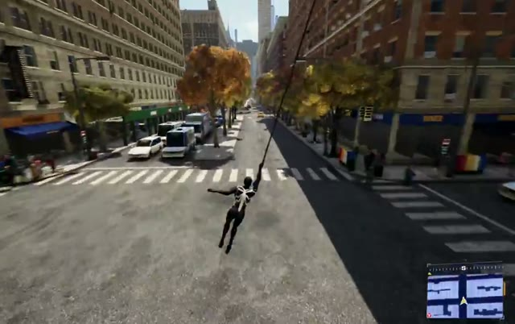

- **本地视频：** [播放或下载 MP4](media/26-xikhar-2103995292983193600.mp4)（约 141 秒）。

**直接播放：**

https://github.com/user-attachments/assets/13838777-a8f8-4534-8572-909a84fdd80e

- **动画与技术：** 浏览器中实时运行的第三人称荡蛛丝游戏，含摆荡、跑墙、俯冲和城市漫游。作者称这是 Opus 5.5 medium 的第三次迭代，结合 Three.js、Blender 与图像生成。
- **提示词：** 未分享逐字提示词。
- **做法：** [仓库 README](https://github.com/xikhar/spiderbench)称，人提供反馈和参考图，Claude 编写代码、着色器、程序化城市和 Blender 脚本生成的模型/动画，另使用生成纹理。游戏以 Three.js/WebGL2 渲染，运动由自定义物理和动画状态机驱动；[前一迭代的作者回复](https://x.com/xikhar/status/2104100443542761541)提到先改善角色装束、动画、模型和玩法，再继续城市改造。仓库明确把它定位为非商业技术基准/粉丝项目，不是正式游戏。
- **可见互动：** 约 7,570 赞、120.8 万次观看。

### 2. 单文件 HTML 的 UI 变形动效 — @twoclipping

- **作者、日期与原帖：** [@twoclipping，2026-09-25](https://x.com/twoclipping/status/2103273003555402193)。

- **本地视频：** [播放或下载 MP4](media/strict/twoclipping-2103272964967804928.mp4)。

**直接播放：**

https://github.com/user-attachments/assets/8b33ecc0-999b-442b-a8f4-b739208036d9
- **动画与技术：** 一个形状在按钮、加载器、播放器、滑杆、标签、图表和命令面板之间连续变形。作者称整段视频均由代码制作，公开的模板明确要求单个 1440×1440 HTML 文件。
- **提示词：** 作者公开的是可复用模板，不一定是这条成片的逐字输入。英文原文节选：

> One HTML file, square 1440x1440. Every style is computed from time inside seek(t): no CSS transitions, no timers, no state carried between frames.

中文对译：

> 只用一个 1440×1440 的方形 HTML 文件。所有样式都由 `seek(t)` 中的时间算出；不用 CSS 过渡、定时器，也不在帧间保留状态。

[原帖包含完整 XML 模板](https://x.com/twoclipping/status/2103273003555402193)，含 inputs、direction、structure、build、gotchas、start 六节。
- **做法：** 节拍采用 120 BPM、7 小节；在完整渲染前先每拍渲染一帧检查。弹簧是闭式阶跃响应；通过 Playwright 每帧采 4 个子帧，再用 ffmpeg `tmix` 合成 60 fps 运动模糊。作者提醒缩放的相机元素勿用 `will-change`，结尾必须与开头的画面、鼠标位置和速度一致。
- **可见互动：** 11,794 赞、956,309 次观看。

### 3. 关于 Claude 的手绘叙事短片 — @kevin_t_ngo

- **作者、日期与链接：** [Kevin Ngo，2026-09-23](https://x.com/kevin_t_ngo/status/2102437977435893771)。

- **本地视频：** [播放或下载 MP4](media/17-kevin_t_ngo-2102437792425070592.mp4)（约 28 秒）。

**直接播放：**

https://github.com/user-attachments/assets/c20d5eb4-5d17-46ca-9aca-ac8f6633dfc6
- **动画与技术：** 镇上的人不断向 Claude 提需求，一位女孩却问它喜欢什么。作者称 Opus 5.5 用 JavaScript 画出每一帧；没有说明更具体的库。
- **提示词：** 未分享提示词。
- **做法：** 帖子只确认逐帧代码绘制，没有给出渲染步骤。可见回复有人询问提示词，但未看到作者解答。
- **可见互动：** 约 6,052 赞、63.5 万次观看。

### 4. 日本山谷中的可驾驶舟船 — @MengTo

- **作者、日期与原帖：** [@MengTo，2026-09-23](https://x.com/MengTo/status/2102760783344189761)。

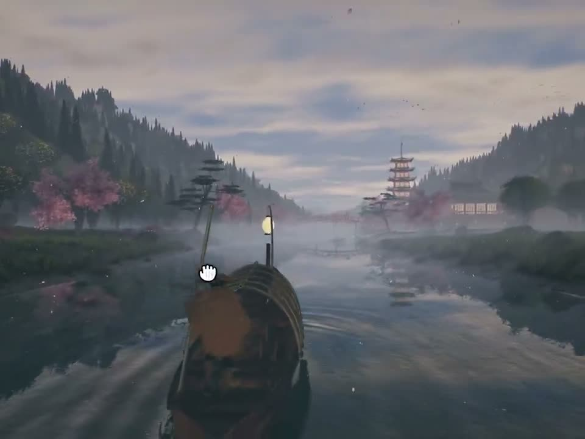

- **本地视频：** [播放或下载 MP4](media/strict/MengTo-2102760366745010177.mp4)。

**直接播放：**

https://github.com/user-attachments/assets/4c4b2548-c367-4693-9627-5629d83faee0
- **动画与技术：** 可玩的日本樱花山谷 3D 场景：船只逆流、天气与昼夜循环、水面反射、人物及建筑。作者明确称使用 Opus 5.5 与 Three.js，并给出[在线场景](https://valley.mengto.here.now)。
- **提示词：** 作者在[后续帖](https://x.com/MengTo/status/2103155074705019158)公开完整长提示词，英文开头原文：

> Create from scratch a fully interactive 3D scene of a traditional wooden riverboat being poled upstream through a mountain river valley in feudal Japan during cherry-blossom season.

中文对译：

> 从零创建一个可完整交互的 3D 场景：樱花季节的封建日本山谷河流中，一艘传统木船被船夫撑着逆流而上。

提示词全文很长，包含地形、船体、水流、人物、天气、交互、性能和测试的逐项要求，见作者原帖。
- **做法：** 要求交付单个可直接打开的浏览器页面，尽量嵌入资源、避免运行时 CDN；设置船只自动驾驶及 WASD/方向键接管；要求在早晨、暴风雨、黄金时刻和夜间截图，检查浏览器控制台并修复穿模、资源加载和相机问题。
- **可见互动：** 6,478 赞、465,444 次观看。

### 5. 骑自行车的鹈鹕 3D 动画 — @addyosmani

- **作者、日期与原帖：** [@addyosmani，2026-09-23](https://x.com/addyosmani/status/2102436416437580159)。

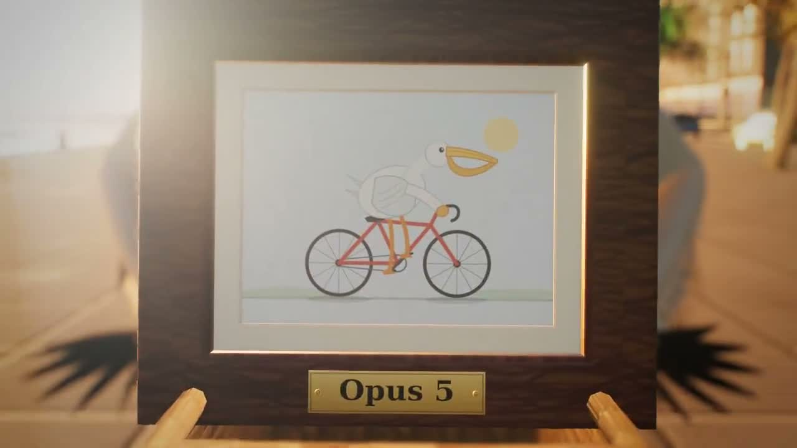

- **本地视频：** [播放或下载 MP4](media/strict/addyosmani-2102433488364597251.mp4)。

**直接播放：**

https://github.com/user-attachments/assets/b12da376-bdc4-4956-b95b-12a4c613fbe7
- **动画与技术：** Addy Osmani 用一段骑自行车的鹈鹕 3D 动画庆祝 Opus 5.5 发布，原帖明确写出 Three.js。
- **提示词：** 未分享提示词。
- **做法：** 作者在[回复](https://x.com/addyosmani/status/2102482988076519846)确认该示例一次生成；未公开逐字提示词或建模细节。
- **可见互动：** 1,986 赞、415,492 次观看。

### 6. 从草图到住宅的建筑动画 — @techartist_

- **作者、日期与链接：** [Techartist，2026-09-23](https://x.com/techartist_/status/2102503719762018434)。

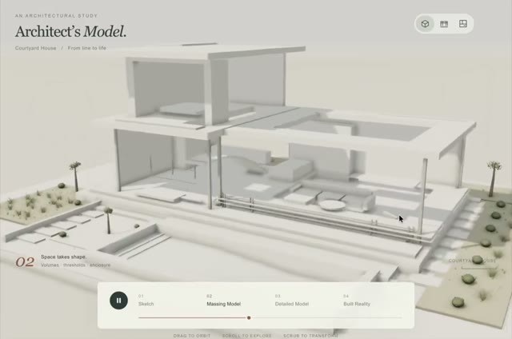

- **本地视频：** [播放或下载 MP4](media/10-techartist_-2102503194777759744.mp4)（约 19 秒）。

**直接播放：**

https://github.com/user-attachments/assets/ebcd87e3-792a-4b46-bea0-14e67e71b475
- **动画与技术：** 3D 建筑依次从初始线条、体量、细节变成完工住宅。作者称 Claude Opus 5.5 使用 Three.js 和 TSL。
- **提示词：** 未分享提示词。
- **做法：** 帖文给出四个清晰的视觉阶段，但没有说明渲染流程。
- **可见互动：** 约 1,911 赞、31 万次观看。

### 7. 《桃花源记》3D 文学场景 — @dotey

- **作者、日期与链接：** [宝玉，2026-09-24](https://x.com/dotey/status/2102940980379017293)。

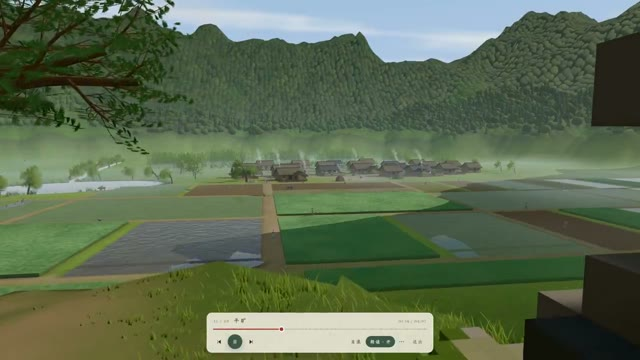

- **本地视频：** [播放或下载 MP4](media/08-dotey-2102939337591603200.mp4)（约 257 秒）。

**直接播放：**

https://github.com/user-attachments/assets/65d68241-5ce6-4874-be67-abb559cd3558
- **动画与技术：** 可交互的 Three.js 场景，提供沿原文推进、带朗读的 28 幕导览。作者称用 Opus 5.5 对旧版本反复打磨，还让模型寻找免费 3D 模型，减少从零建模。
- **提示词：** 最终作品没有单一的真实提示词；作者明确说它来自反复迭代。[回复](https://x.com/dotey/status/2102994911171903830)附有[事后还原的起始提示词](https://github.com/JimLiu/taohuayuan/blob/main/docs/prompt.md)，不能当作完整对话记录。该文开头原文为「你是一位兼具文学理解力的场景艺术导演、叙事交互设计师和资深网页 3D 开发者。」
- **做法：** 这份还原提示词要求一条叙事时间线统管文本、镜头、人物、昼夜、落花、风、曝光与朗读，并要求仅凭幕号及幕内进度复原状态；还列出 28 幕及真实浏览器截图验收项目。[源码仓库](https://github.com/JimLiu/taohuayuan)记录了 Vite 构建、素材压缩、音画同步与逐帧推进的 1080p60 录制。作者称迭代了一天；README 提醒部分人物模型在许可解决前只适合个人学习。
- **可见互动：** 约 594 赞、21.2 万次观看。

### 8. 40 秒讲解浏览器如何工作 — @addyosmani

- **作者、日期与原帖：** [@addyosmani，2026-09-24](https://x.com/addyosmani/status/2103009037164110327)。

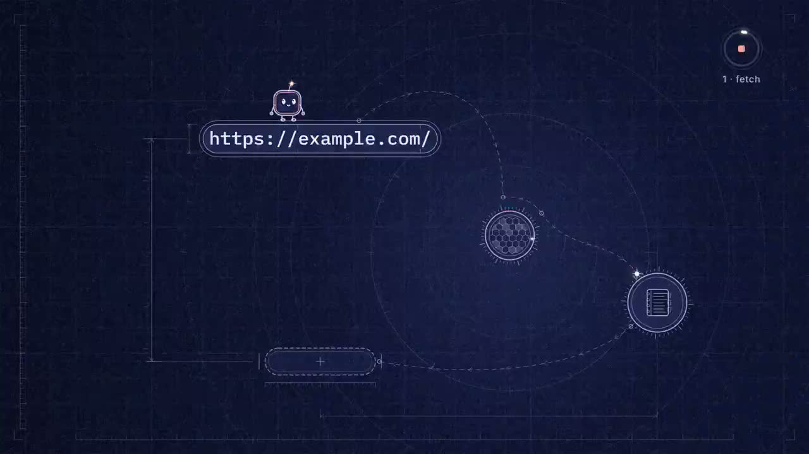

- **本地视频：** [播放或下载 MP4](media/strict/addyosmani-2102980713603887104.mp4)。

**直接播放：**

https://github.com/user-attachments/assets/61e26a76-b021-459d-be4d-4d53a591566b
- **动画与技术：** 40 秒浏览器工作原理讲解动画；作者明确说 Opus 5.5 用 JavaScript 绘制了每一帧。
- **提示词：** 未分享提示词。
- **做法：** 作者在[回复](https://x.com/addyosmani/status/2103132367506604243)回答这是一次生成，并说其测试 Opus 5.5 的大多数示例也都是一次生成；未公开具体渲染脚本。
- **可见互动：** 2,379 赞、211,621 次观看。

### 9. 三分钟人工智能发展史 — @kimmonismus

- **作者、日期与链接：** [Chubby，2026-09-24](https://x.com/kimmonismus/status/2102844654169575547)。

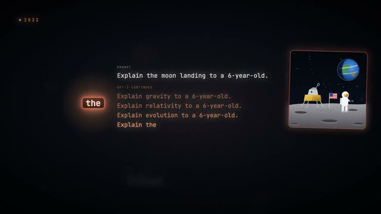

- **本地视频：** [播放或下载 MP4](media/29-kimmonismus-2102844491820670976.mp4)（约 180 秒）。

**直接播放：**

https://github.com/user-attachments/assets/c68895e2-e8ed-40e6-a3d6-a19326c84e08

- **动画与技术：** 三分钟的人工智能发展史短片，从《Attention Is All You Need》讲到 AGI。作者称全部画面由代码渲染，没有素材视频、图片生成器或视频生成器；约 7,400 行 React/TypeScript，以 Remotion 编排，图像由 SVG/Canvas 绘制，配有开源 TTS 旁白和 Python 合成配乐。
- **提示词：** 未分享完整提示词；作者只公开了“快速制作一段从《Attention Is All You Need》到 AGI 的 AI 史短片”这一任务意图，不能当作逐字提示词。
- **做法：** 使用 Claude Code 中的 Opus 5.5 生成逐帧代码、合成语音和音乐，作者自述约耗时一小时、占每周额度约 7%。该案例给出了比较完整的无素材代码视频栈：Remotion 时间轴 + SVG/Canvas 画面 + TTS + Python 音乐。
- **可见互动：** 约 2,652 赞、19.3 万次观看。

### 10. 程序化像素赛马 — @victormustar

- **作者、日期与原帖：** [@victormustar，2026-09-23](https://x.com/victormustar/status/2102707412704919910)。

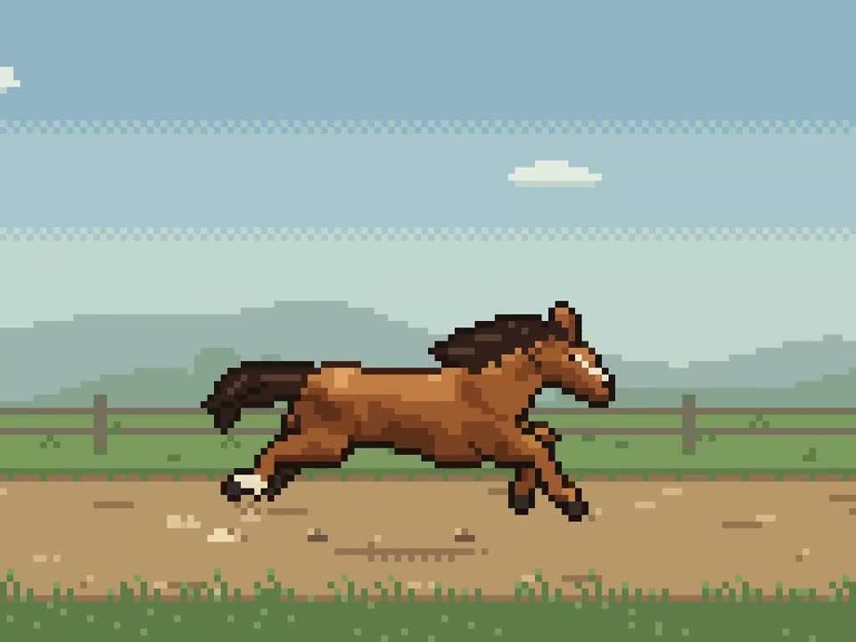

- **本地视频：** [播放或下载 MP4](media/strict/victormustar-2102707356932993024.mp4)。

**直接播放：**

https://github.com/user-attachments/assets/a40a19bb-41e3-426b-b449-87e18f661a88
- **动画与技术：** 奔跑的像素马：128×96 像素、12 个步态姿势、关节腿由反向运动学驱动。单个 HTML 文件，以原生 JavaScript 和 Canvas 2D 绘制，没有图片或库。
- **提示词：** 未分享这匹马的提示词。作者在[回复](https://x.com/victormustar/status/2102773201214607480)转引的是另一件“施法巫师”作品的提示词，不能冒充本例提示词。
- **做法：** 作者在[回复](https://x.com/victormustar/status/2102711523596734738)称使用 xhigh effort。制作约束来自原帖：低分辨率、程序化每个像素、逆运动学和固定步态。
- **可见互动：** 1,113 赞、178,769 次观看。

### 11. JavaScript 逐帧短动画 — @strawhatsu4

- **作者、日期与链接：** [Hunter Su，2026-09-23（上海时间）](https://x.com/strawhatsu4/status/2102457111787745405)。

- **本地视频：** [播放或下载 MP4](media/30-strawhatsu4-2102457077390299136.mp4)（约 14 秒）。

**直接播放：**

https://github.com/user-attachments/assets/1761d4fc-0696-4517-9dcf-c2e3e119cd82

- **动画与技术：** 原帖附一段约 14 秒的短动画，作者明确称 Claude Opus 5.5 用 JavaScript 画出了每一帧。原帖没有说明动画主题、具体 JavaScript 库或编码方式，因此不作进一步推断。
- **提示词：** 未分享提示词。
- **做法：** 可确认的步骤只有用 JavaScript 逐帧绘制；没有公开参考素材、帧捕捉与合成方式。
- **可见互动：** 约 1,513 赞、14.4 万次观看。

### 12. 16 个 HTML/SVG 动效 — @charliejhills

- **作者、日期与链接：** [Charlie Hills，2026-09-27](https://x.com/charliejhills/status/2103893708550914076)。

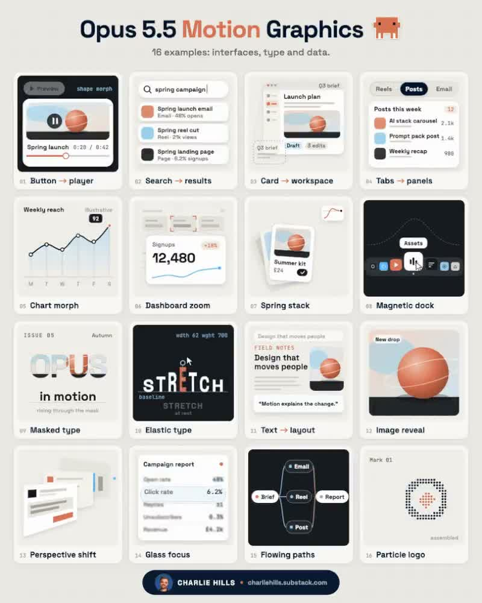

- **本地视频：** [播放或下载 MP4](media/16-charliejhills-motion-graphics.mp4)（8 秒）。这是原帖附带的 GIF 动画转换后的 MP4，展示 16 个动效预览；并非 16 个独立源文件。

**直接播放：**

https://github.com/user-attachments/assets/f43aa102-f1bc-42fa-a269-2ee873c652fa
- **动画与技术：** 用 Claude Code、HTML 和 SVG 制作的 16 个动效，包括会变形的图表。
- **提示词：** 未分享提示词。
- **做法：** 作者给出三步：先确定一个运动对象（例如变形图表）；给 Claude 看参考，并列出每个状态；要求用 HTML/SVG 实现，再逐轮修正。原帖还链接了 [Substack 合集](https://charliehills.substack.com/p/opus-55-motion-graphics)，但 Chrome 只显示安全验证页，因此未能读取文章内容。
- **可见互动：** 约 1,230 赞、13.4 万次观看。

### 13. 《Small Print》代码绘制叙事短片 — @Voxyz_ai

- **作者、日期与原帖：** [@Voxyz_ai，2026-09-23](https://x.com/Voxyz_ai/status/2102531681450119426)。

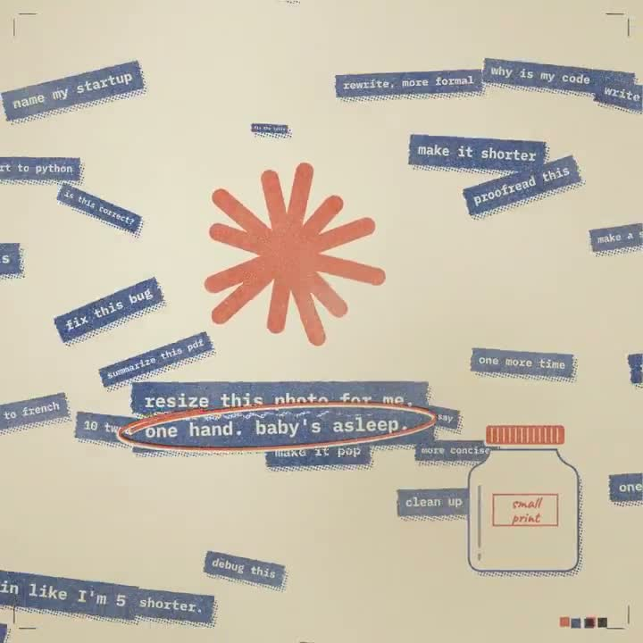

- **本地视频：** [播放或下载 MP4](media/strict/Voxyz_ai-2102528357988515840.mp4)。

**直接播放：**

https://github.com/user-attachments/assets/61a26b37-a77f-426f-b5f1-85f32724713a
- **动画与技术：** 讲述 Claude 从请求中收集人性片段、把文字化作星座的叙事动画。作者称无图像素材，所有画面都是 JS，在一个 index.html 中用 Hyperframes 渲染。
- **提示词：** 未分享提示词。
- **做法：** 作者称自己没有写代码；模型写故事、绘制逐帧画面和制作音乐。音乐以 Python 合成，成片后又逐秒检查和润色。
- **可见互动：** 942 赞、122,782 次观看。

### 14. 一镜到底的 UI 变形产品片 — @twoclipping

- **作者、日期与链接：** [zero，2026-09-26](https://x.com/twoclipping/status/2103835273813496100)。

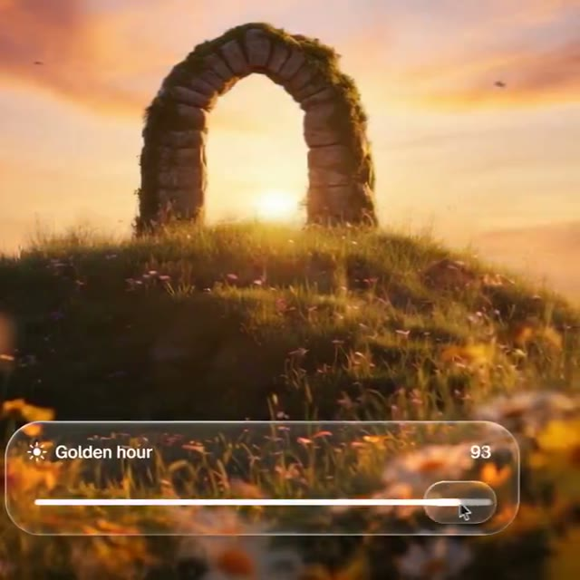

- **本地视频：** [播放或下载 MP4](media/01-twoclipping-2103830256347910144.mp4)（约 29 秒）。

**直接播放：**

https://github.com/user-attachments/assets/0505834e-9389-4140-b1ad-8074d0e322d6
- **动画与技术：** 正方形产品发布片，字标、照片网格、玻璃质感工具栏、手机界面、订单进度与墙上装裱画面连续变形。作者称它由一个 HTML 文件中的纯代码实现，涉及 SVG 滤镜、Canvas、确定性的 seek(t)、Playwright 逐帧抓取和 ffmpeg。
- **提示词：** 作者公布了完整的英文 XML 式提示词，原文与中文对译见文末附录 A。
- **做法：** 提示词要求先收集素材，再审核节拍图和四张静帧，之后制作完整影片。它明确指定 120 BPM、弹簧运动、60 fps、每帧四个子帧，以及按节拍检查画面和检测单帧突变。帖文所说的「不用外部工具」应理解为不用额外的动效服务或 MCP；提示词本身仍要求素材视频、音乐和音效。
- **可见互动：** 约 1,990 赞、10.9 万次观看。

### 15. 可交互赛博朋克下层小镇 — @akakuma0219

- **作者、日期与原帖：** [@akakuma0219，2026-09-26](https://x.com/akakuma0219/status/2103820733159981151)。

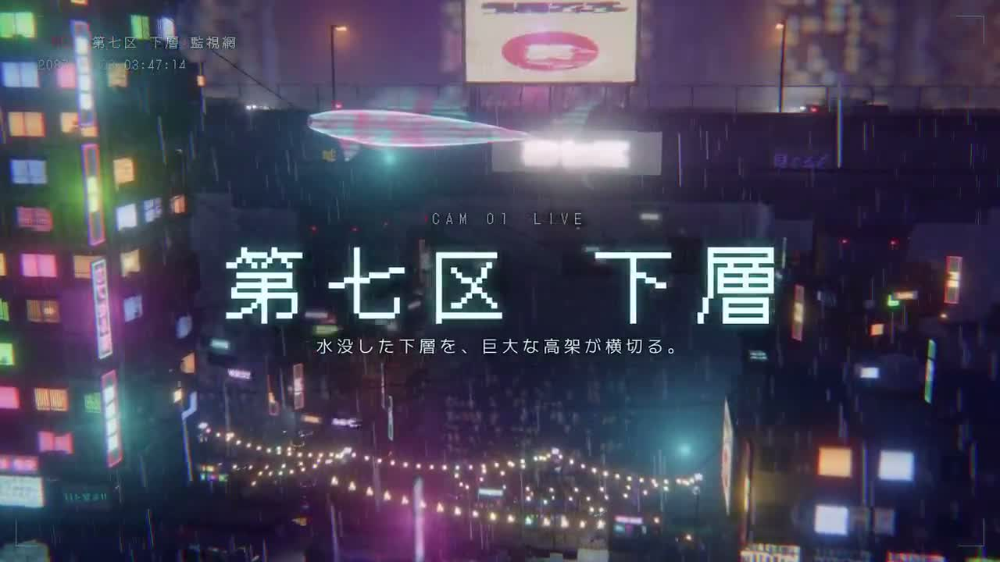

- **本地视频：** [播放或下载 MP4](media/strict/akakuma0219-2103820663006109696.mp4)。

**直接播放：**

https://github.com/user-attachments/assets/e5c5b1e3-0a0a-4771-a339-20370d4522a1
- **动画与技术：** 浏览器中可切换七个监视视角、天气、密度和无人机视角的小镇。作者明确称 Opus 5.5 使用 Three.js，建筑、居民、车辆和雨光以代码生成。
- **提示词：** 作者在[日文方法回复](https://x.com/akakuma0219/status/2103820736519708709)公开起始提示词。原文节选：

> Three.jsで斜め上から見下ろす「箱庭」3Dを作ってください。
> テーマ：雨の夜の水没したサイバーパンク下層街

中文对译：

> 请用 Three.js 制作一个从斜上方俯视的“箱庭”3D。
> 题材：雨夜中被淹没的赛博朋克下层街。
- **做法：** 作者建议先改写主题，再要求不用图像和 3D 模型、全部代码生成；给 5–7 个镜头按钮并让模型先截图自查。之后每轮具体指出 1–2 个问题，再加入天气、跟随、无人机、列车和全屏功能；若变慢，要求测 fps 并优化到 60 fps。
- **可见互动：** 619 赞、75,047 次观看。

### 16. 鸡尾酒配方动态图解 — @Ror_Fly

- **作者、日期与链接：** [Rory Flynn，2026-09-24](https://x.com/Ror_Fly/status/2102853258582880547)。

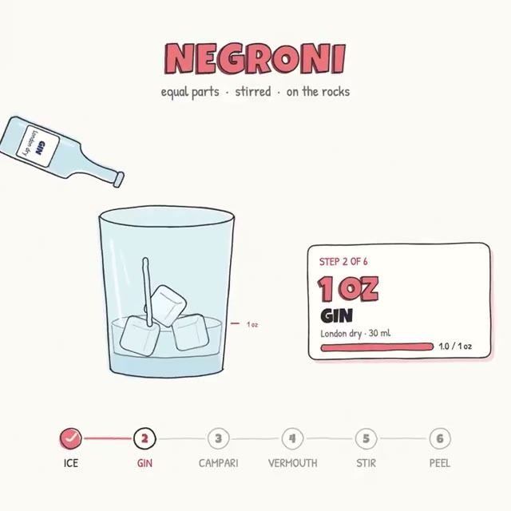

- **本地视频：** [播放或下载 MP4](media/02-Ror_Fly-2102853041246347264.mp4)（约 30 秒）。

**直接播放：**

https://github.com/user-attachments/assets/7e6ab122-2176-420f-a5e4-274a4590e56a
- **动画与技术：** 从一张参考图做出约 30 秒的配方讲解动画，呈现从空杯到成品鸡尾酒的过程。作者称 Opus 用 HTML/JavaScript 渲染。
- **提示词原文：**

> We're going to try a little test. Do you think you could render a recipe motion graphic animation using javascript or html (w/e you think will produce the best) to show the full recipe from start to finish (empty glass to completed cocktail) - Explainer video style - Showing the recipe ingreidents + measurements as they're going into the cup. Should be a 30s video.

- **提示词译文：**

> 我们来做个小测试。你能否用 JavaScript 或 HTML（选你认为效果最好的方式）制作一段配方动态图解，从头到尾展示完整做法——从空杯到调好的鸡尾酒？采用讲解视频的风格，在原料加入杯中的同时显示原料名称和用量。视频时长应为 30 秒。

- **做法：** 作者在[回复](https://x.com/Ror_Fly/status/2102914654066610195)中确认参考素材只有一张图；[后续帖子](https://x.com/Ror_Fly/status/2103205517950628040)称又让四个子智能体沿用同一设计系统，从基础视频制作四个变体。
- **可见互动：** 约 1,017 赞、7.4 万次观看。

### 17. Replit JavaScript 动画短片 — @samuel_spitz

- **作者、日期与原帖：** [@samuel_spitz，2026-09-25](https://x.com/samuel_spitz/status/2103293794594816100)。

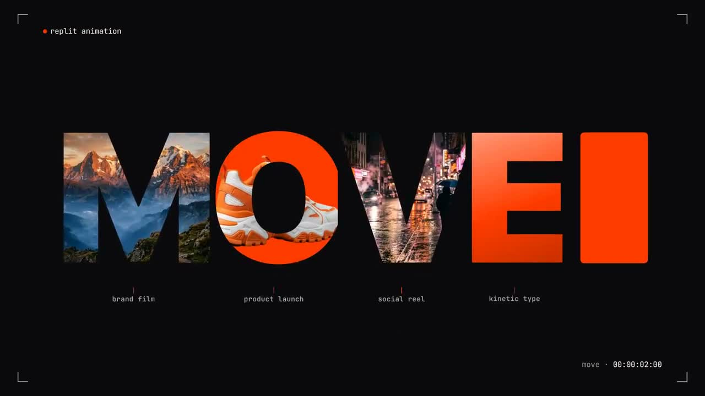

- **本地视频：** [播放或下载 MP4](media/strict/samuel_spitz-2103292714066587649.mp4)。

**直接播放：**

https://github.com/user-attachments/assets/b66d509a-ac37-44ae-bf39-0fd82abafc9a
- **动画与技术：** 作者展示在 Replit 中结合 Opus 5.5 生成的动画视频，明确称由 JavaScript 制作。原帖没有解释画面主题。
- **提示词：** 未分享提示词。
- **做法：** 作者称生成用时不足 30 分钟；未披露其他步骤。
- **可见互动：** 1,026 赞、61,439 次观看。

### 18. 中秋拼贴风短片 — @ring_hyacinth

- **作者、日期与链接：** [Ring Hyacinth，2026-09-24](https://x.com/ring_hyacinth/status/2102986085328716066)。

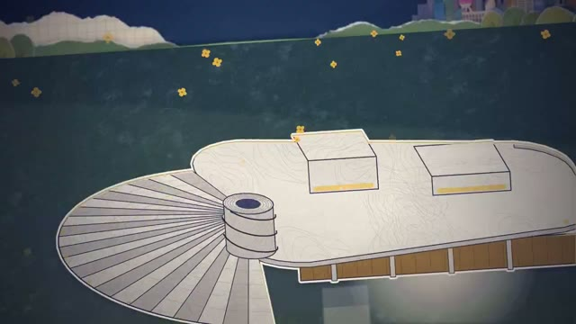

- **本地视频：** [播放或下载 MP4](media/07-ring_hyacinth-2102985762996379648.mp4)（约 40 秒）。

**直接播放：**

https://github.com/user-attachments/assets/73fc6357-e84f-4db3-8f29-5cf74f10e1c1
- **动画与技术：** 手作质感的中秋拼贴动画。作者提供脚本和音乐；Opus 用 JavaScript 逐帧绘制，用 p5.js 和 p5.brush 制作手绘纹理；Nano Banana Pro 生成背景底稿和纸张材质，Node.js 程序合成音效。
- **提示词：** 未分享提示词。
- **做法：** 作者明确区分了人工提供的脚本和音乐、代码绘制的动画，以及生成的静态视觉素材。
- **可见互动：** 约 682 赞、5.3 万次观看。

### 19. 单文件浏览器 78 秒动画短片 — @jurlycat

- **作者、日期与原帖：** [@jurlycat，2026-09-23](https://x.com/jurlycat/status/2102645793828036643)。

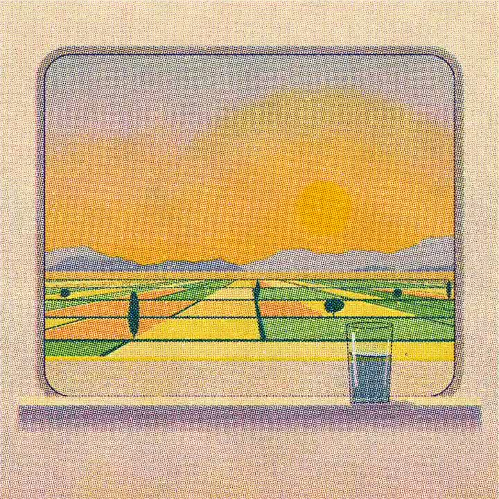

- **本地视频：** [播放或下载 MP4](media/strict/jurlycat-2102645585169764352.mp4)。

**直接播放：**

https://github.com/user-attachments/assets/c3b832d2-95d5-4b17-b3ec-e46d5e65163e
- **动画与技术：** 78 秒动画电影，单个 index.html，以原生 JavaScript、Canvas 2D 和 Web Audio 直接在浏览器逐帧绘制画面并生成声音；作者称无图片、视频文件或外部库。
- **提示词：** 未分享提示词。
- **做法：** 作者称 Opus 5.5 约 45 分钟完成；在[回复](https://x.com/jurlycat/status/2102809525913096622)说大部分创意由模型即兴发挥，自己只是持续微调氛围，并在[另一回复](https://x.com/jurlycat/status/2102645799226097923)提供源码链接。
- **可见互动：** 1,121 赞、46,067 次观看。

### 20. Three.js 创意体验动画 — @chetanankola

- **作者、日期与原帖：** [@chetanankola，2026-09-24](https://x.com/chetanankola/status/2103008022369099992)。

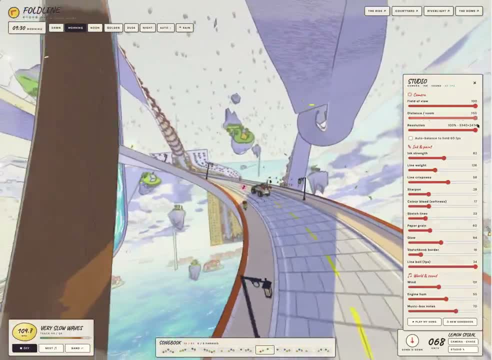

- **本地视频：** [播放或下载 MP4](media/strict/chetanankola-2103003207203213312.mp4)。

**直接播放：**

https://github.com/user-attachments/assets/42eca8b2-26e6-4963-8f2f-09f911dad4e7
- **动画与技术：** 作者展示另一版 Three.js + Claude Opus 5.5 制作的动态 3D 体验。具体场景主题原帖没有说明。
- **提示词：** 未分享提示词。
- **做法：** 作者在[回复](https://x.com/chetanankola/status/2103339451485478926)表示该作品的渲染负荷并不高；未披露代码或详细流程。
- **可见互动：** 976 赞、38,084 次观看。

### 21. 零下载素材的程序化 3D 世界 — @AndreiProvkin

- **作者、日期与原帖：** [@AndreiProvkin，2026-09-27](https://x.com/AndreiProvkin/status/2103919236653428985)。

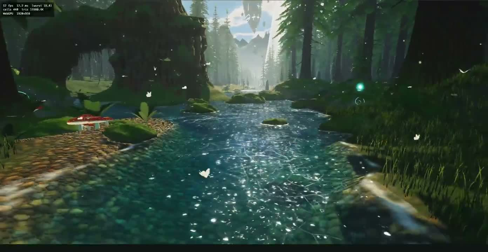

- **本地视频：** [播放或下载 MP4](media/strict/AndreiProvkin-2103918099665698816.mp4)。

**直接播放：**

https://github.com/user-attachments/assets/eb4c21e0-573e-4c31-a35f-64dc34dfc981
- **动画与技术：** 由 Three.js 构建的程序化 3D 世界，作者称没有下载素材，包括声音也由程序生成；Opus 5.5 是主导模型。
- **提示词：** 未分享完整提示词；作者只说明一条提示词加一张参考图。
- **做法：** 作者称先让模型制定计划，再手动启动三个计划步骤，首版不要求修正；自报耗时 3 小时 36 分、445 次请求、约 5010 行新增代码、API 标价约 60 美元。
- **可见互动：** 641 赞、30,431 次观看。

### 22. 纯 WebGL2 实时光追动效 — @akiy_8

- **作者、日期与原帖：** [@akiy_8，2026-09-25](https://x.com/akiy_8/status/2103434383218872503)。

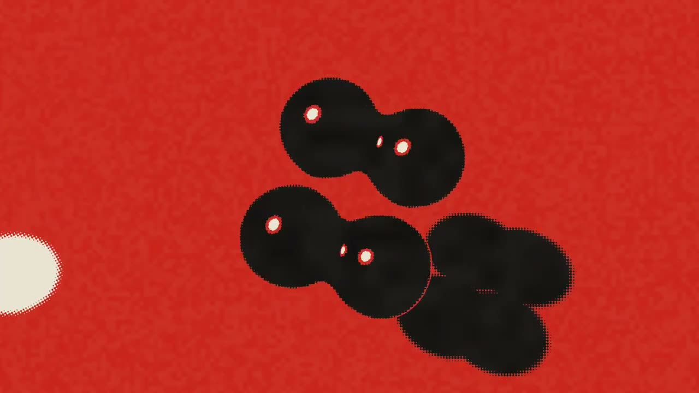

- **本地视频：** [播放或下载 MP4](media/strict/akiy_8-2103433334097686528.mp4)。

**直接播放：**

https://github.com/user-attachments/assets/c65d306b-ba79-48a1-8dda-21245fcf6d46
- **动画与技术：** 作者参考热门 Opus 5.5 动效并改写提示词，做出单个 HTML 文件的纯 WebGL2 动画；全靠数学公式实时光追 150 个球体，无图像、视频素材。
- **提示词：** 作者说“调整了提示词”，但未在这条帖中公开改写后的逐字版本；所引用帖中的另一条提示词不能当作本例的真实提示词。
- **做法：** 作者强调没有使用 Three.js，用原生 WebGL2 再现印刷网点和版偏移。
- **可见互动：** 350 赞、27,819 次观看。

### 23. 16 场景地球与宇宙史代码动画 — @AIMevzulari

- **作者、日期与原帖：** [@AIMevzulari，2026-09-25](https://x.com/AIMevzulari/status/2103386522510573967)。

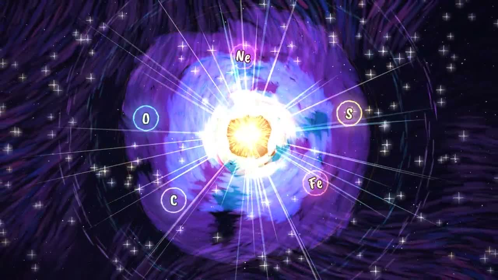

- **本地视频：** [播放或下载 MP4](media/strict/AIMevzulari-2103255788554792960.mp4)。

**直接播放：**

https://github.com/user-attachments/assets/fa935c12-98bc-4657-aff8-42d98c1c6c1e
- **动画与技术：** 16 场景短片，从超新星、寒武纪海洋、恐龙灭绝到红巨星和黑洞。作者称使用 Opus 5.5 与 JavaScript Canvas 2D，所有画面由程序化笔触和纸张纹理生成，无图像/视频模型或 3D 库。
- **提示词：** 未分享提示词。
- **做法：** 作者称一次生成约耗时一小时；音乐完全以代码合成，土耳其语/英语配音使用 Higgsfield 与 Claude MCP。配音工具不改变画面的 Canvas 2D 技术归类。
- **可见互动：** 90 赞、26,621 次观看。

### 24. Willowmere 程序化游戏世界 — @jurlycat

- **作者、日期与链接：** [Jurly，2026-09-27](https://x.com/jurlycat/status/2104002281641542008)。

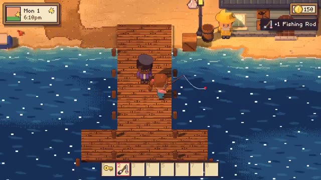

- **本地视频：** [播放或下载 MP4](media/09-jurlycat-2104002235269320704.mp4)（约 61 秒）。

**直接播放：**

https://github.com/user-attachments/assets/deb371b1-3f8e-4661-84cc-583547a416b6
- **动画与技术：** 类游戏的 3D 世界，用 Three.js 程序化生成物件；音乐和音效由浏览器的 Web Audio API 合成。作者称没有 PNG、3D 模型文件或音频采样。
- **提示词：** 未分享提示词。
- **做法：** 用程序化几何和合成声音替代传统素材管线。
- **可见互动：** 约 574 赞、2.2 万次观看。

### 25. 东方文明 3D 讲解片 — @yanhua1010

- **作者、日期与链接：** [Yanhua，2026-09-26](https://x.com/yanhua1010/status/2103712543168680363)。

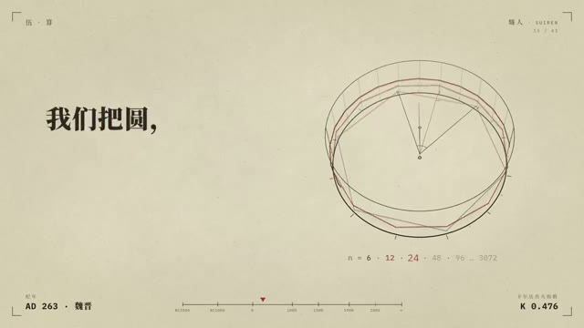

- **本地视频：** [播放或下载 MP4](media/11-yanhua1010-2103711331203649537.mp4)（约 135 秒）。

**直接播放：**

https://github.com/user-attachments/assets/52039085-2dff-4d22-9a92-4fb61d15d103
- **动画与技术：** 介绍「神秘东方文明」的短片。作者列出 HyperFrames（HTML 渲染视频）、Three.js（3D 效果）、HeyGen 曲库和 ffmpeg（合成视频）。
- **提示词：** 未分享提示词。
- **做法：** 原帖给出明确的工具链：HTML 场景、3D 效果、曲库配乐、视频合成。
- **可见互动：** 约 204 赞、2 万次观看。

### 26. 手绘科普风程序化动画短片 — @leo_xiaolei

- **作者、日期与原帖：** [@leo_xiaolei，2026-09-23](https://x.com/leo_xiaolei/status/2102724347446305104)。

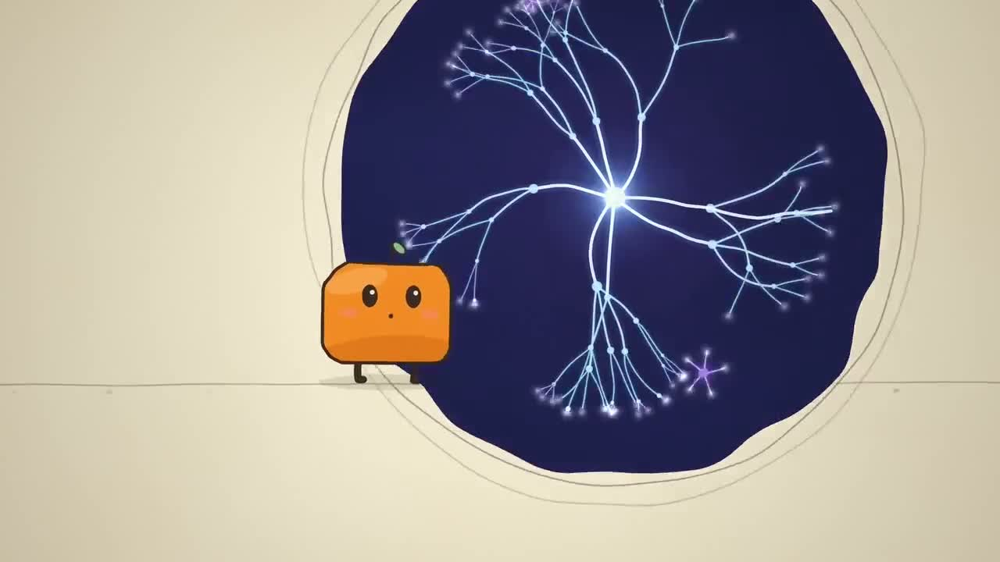

- **本地视频：** [播放或下载 MP4](media/strict/leo_xiaolei-2102724181070839808.mp4)。

**直接播放：**

https://github.com/user-attachments/assets/befec792-eb7d-44f0-bbd5-b2df21cd7f9a
- **动画与技术：** 约 28 秒手绘风短片，让橙色小角色依次变为神经元、三棱镜、向日葵、星系、黑洞和地球升起。作者称由 Opus 5.5 直出；其公开提示词指定 Vite、TypeScript、HTML、Canvas 2D 与 requestAnimationFrame，必要时才引入 Three.js。
- **提示词：** 作者在[原帖](https://x.com/leo_xiaolei/status/2102724347446305104)公开长篇中文参考提示词。开头原文：

> 你现在是 Claude Opus 5.5，作为资深创意编程工程师（Creative Coder）、动态设计师（Motion Designer）与前端动画工程师。
> 你的任务是复现我所提供的参考视频中的视觉语言、节奏律动、转场逻辑以及整体氛围质感。

提示词全文在原帖，包含 26 节场景与过渡要求。
- **做法：** 要求 25–30 秒、1920×1080、30 FPS 和确定性时间轴；以形态变化衔接各场景，固定种子保证可重复播放。作者提醒该提示词会消耗较多额度和时间。
- **可见互动：** 121 赞、19,655 次观看。

### 27. Three.js 与 GLSL 程序化视听作品 — @techartist_

- **作者、日期与原帖：** [@techartist_，2026-09-27](https://x.com/techartist_/status/2104186357824487573)。

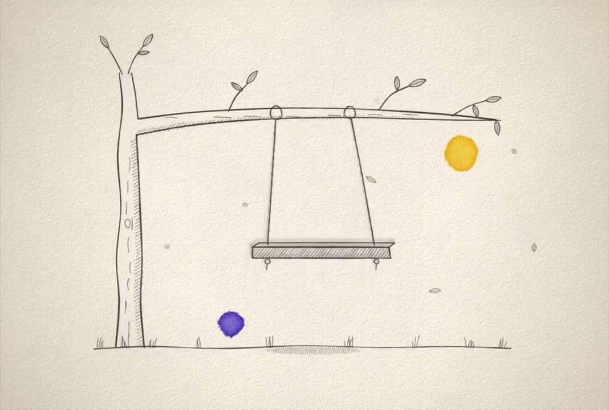

- **本地视频：** [播放或下载 MP4](media/strict/techartist_-2104185406363455488.mp4)。

**直接播放：**

https://github.com/user-attachments/assets/6465a01e-8706-40a2-94d1-dbbcd9eda255
- **动画与技术：** 作者称以 Opus 5.5 用代码制作视觉和声音：Three.js、GLSL、Rough.js、Simplex Noise，以及 Tone.js、Web Audio 和 Salamander Piano 采样。
- **提示词：** 未分享提示词。
- **做法：** 作者给出[源码入口](https://github.com/iamtechartist)；在[回复](https://x.com/techartist_/status/2104198614541390286)说选择代码是因为可以做多种交互。
- **可见互动：** 262 赞、10,654 次观看。

### 28. 单 HTML 文件的 3D 动画 — @liebert_2026

- **作者、日期与原帖：** [@liebert_2026，2026-09-26](https://x.com/liebert_2026/status/2103856499319857507)。

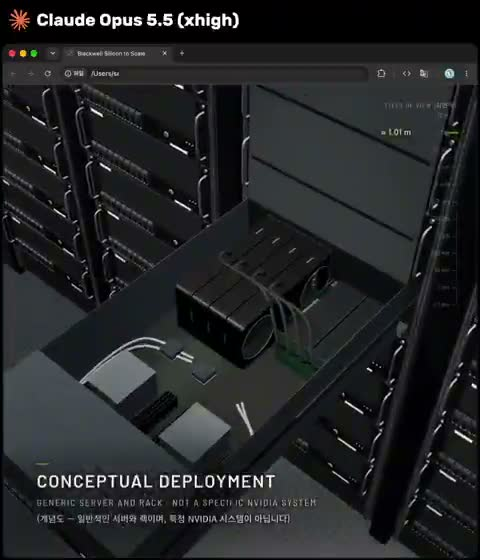

- **本地视频：** [播放或下载 MP4](media/strict/liebert_2026-2103494270854557696.mp4)。

**直接播放：**

https://github.com/user-attachments/assets/fcf56634-87d0-4db3-a68c-7479120257a9
- **动画与技术：** 约 49 秒的 3D 动画；作者明确称 Opus 5.5 把整段动画做在单个 HTML 文件里。
- **提示词：** 未分享提示词。
- **做法：** 原帖未披露具体 3D 库、场景源码或渲染步骤。
- **可见互动：** 34 赞、2,600 次观看。

### 29. 《Nexus》30 秒图书预告片 — @staskulesh

- **作者、日期与链接：** [Stas Kulesh，2026-09-28](https://x.com/staskulesh/status/2104292430619214301)。

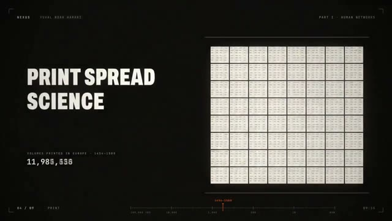

- **本地视频：** [播放或下载 MP4](media/20-staskulesh-2104291932939689984.mp4)（约 30 秒）。

**直接播放：**

https://github.com/user-attachments/assets/306b5887-2606-44d6-8be0-c47f767bb0ef
- **动画与技术：** 为一本 592 页的书制作 30 秒动效预告。作者称 Claude Cowork 中的 Opus 5.5 Max 读取 PDF 和维基百科页面，设计九个场景，用无头 Chromium 中的 Canvas 渲染动画，再用 NumPy 合成音乐。
- **提示词原文：**

> Create a dynamic 30-second motion trailer, like a motion designer’s showreel, explaining this book.

- **提示词译文：**

> 制作一段有动感的 30 秒图书预告片，像动效设计师的作品集短片一样，向观众介绍这本书。

- **做法：** 作者称采用 128 BPM、16 小节的节拍结构，在中点切换色板，以数学函数驱动 Canvas 动画，使用每帧 10–32 个子帧制造运动模糊；还检查并修正画面、时序和音画同步。声称产物为 1080p30、25 MB，智能体约工作一小时。
- **可见互动：** 4 赞、417 次观看。

### 30. 腰带授予动画 — @ommakes

- **作者、日期与链接：** [Om，2026-09-28](https://x.com/ommakes/status/2104397887144694195)。

- **本地视频：** [播放或下载 MP4](media/21-ommakes-2104397849081368576.mp4)（约 13 秒）。

**直接播放：**

https://github.com/user-attachments/assets/e186fe15-db41-4961-98d6-f5774073525d
- **动画与技术：** Unsoku 产品中用于授予腰带的短动画。作者明确提到 Opus 5.5 与 Three.js。
- **提示词：** 未分享提示词。
- **做法：** 原帖及可见回复没有进一步制作细节。
- **可见互动：** 赞数未显示；23 次观看。

## 附录 A — @twoclipping 完整提示词

以下为[原帖](https://x.com/twoclipping/status/2103835273813496100)提示词英文原文，保留原有大小写及标点。

    <inputs>
    Ask me for: a one-word brand name for the wordmark (a verb works best), 9 to 12 high-res photos, a royalty-free song around 120 BPM with a drop and a quiet breakdown (Mixkit, free for commercial use), and a free stock clip of a plain wall with moving plant shadows (Pexels).
    </inputs>

    <direction>
    An Apple-keynote launch film, 2D only, one continuous take. Every scene is made out of the previous one: nothing fades, blurs or cuts. Objects change shape instead: text rises out of a mask line, icons pop from zero on a spring, bars draw across, pages push, and a black shape floods the whole frame and contracts into the next scene. Warm off-white canvas, black UI, iOS 26 liquid glass over the photos. Archivo (wdth 125, weight 800) for the wordmark, Geist for UI. A cursor drives every change with real clicks, drags and long-presses. The camera zooms screen-studio style so each moment fills the square, and the cursor scales with it.
    Banned: crossfades, blur-ins, brightness "developing", 3D flips, particles, glows, holds longer than 1s, anything that looks like a template.
    </direction>

    <structure>
    120 BPM, 54 beats, something happens on every beat.
    Open: the wordmark squeezes into its own period like an accordion, the dot grows into a black pill, a label rises inside it. Click: six iris blades close over the label and snap open onto a photo. The circle becomes a square, shrinks, the grid unfolds from behind it like a paper map (center, plus, corners), reflows into a bento, and a click zooms into one tile, landing exactly on the drop.
    Glass: a glass word pops in letter by letter, melts into a droplet that stretches into a glass toolbar. The adjust icon turns it into a slider. Dragging relights the photo from day to golden hour (two aligned shots), and the knob turns into a glass lens while held. It lifts into a glass orb, the next photo opens inside it as a circle, and the orb expands into a lock screen: glass clock digits, date, and a home bar that stretches into a glass music player.
    Stage: the lock screen pulls back into a phone (the bezel grows out of the screen edge). The Dynamic Island stretches like liquid, pinches off, flies over and grows into a Mac window that rolls up like a blind. Long-press the wallpaper, drag it onto a Safari tab, the page pushes in, drop it and it becomes the hero of a landing page. Scroll: the hero morphs into a framed print on a product card, with the mat and molding growing out of the photo's edge. Pick a frame color (it paints across) and a size, then the nav button flies down into "Order print".
    Order: one black shape keeps morphing: Ordered ✓ → Printing % → On its way (a van on a route) → Delivered ✓.
    Wall: the delivered circle floods the frame edge to edge, holds black for a beat, and contracts into the framed print hanging on the real wall footage. The same iris opens onto the print, closes again, the frame floods the screen and contracts into the pill → the dot → the letters spring back out, landing on the beat return. Last frame = first frame.
    </structure>

    <build>
    1. One HTML file, square 1440x1440. Every style is computed from time inside an async seek(t): no CSS transitions, no timers, no state between frames.
    2. Springs are closed-form step responses. A value with many targets is the sum of one spring per change, so it stays a pure function of time.
    3. Liquid glass: each glass element holds its own clone of the scene behind it, filtered with an SVG feImage displacement map (a rounded-rect distance field) through three feDisplacementMaps at slightly different scales for chromatic edges, plus a rim light. Glass letters: a canvas distance field per glyph gives the map, mask and highlights.
    4. Goo: blur + alpha threshold, then composite the source atop it so the glass stays sharp inside.
    5. Iris: 6 blades around a hexagonal aperture. Each blade is its two vertices, both edge extensions and the SHORT arc between them.
    6. Wordmark squeeze: every letter moves toward the dot by the same factor and its drawn width follows (narrow the wdth axis, scale the rest), so the letters stay touching.
    7. Footage: re-encode all-intra (ffmpeg -g 1), load it as a blob URL, await 'seeked' before drawing each frame.
    8. Sound: a downloaded SFX for every event (Mixkit), never synthesized, each placed by its measured peak. The song starts on a downbeat: the zoom lands on the drop, the wall sits in the breakdown, the wordmark returns with the beat. Loudnorm to -14 LUFS.
    9. Render with Playwright: 4 subframes per frame blended with ffmpeg tmix, 60fps. Check one frame per beat, then scan for single-frame pops (frame-difference spikes 3x their neighbours).
    </build>

    <gotchas>
    backdrop-filter: url() misreads displacement maps in Chromium, so clone the scene instead. A flood must overscale past the corners and take about 0.3s, or half the screen changes in one frame. A child with visibility: visible shows through a hidden parent, so use inherit. Text that swaps inside a morphing shape needs its own mask. python http.server can't range-seek video, so use the blob URL.
    </gotchas>

    <start>
    Ask me for the inputs, then show me the beat map and 4 stills (open, glass, stage, wall) before you write the full film.
    </start>

### 中文译文

以下译文与上方英文提示词逐节对应；技术标识、参数、素材来源与工具名称保留原样。

**<inputs> 输入素材** 
请向我索取：一个用于字标的单词品牌名（动词最好）、9–12 张高分辨率照片、一首约 120 BPM 且有高潮和安静间奏的免版税歌曲（Mixkit，可免费商用），以及一段植物影子在素墙上移动的免费素材视频（Pexels）。

**<direction> 视觉指导** 
制作一段 Apple 发布会式的产品短片，只用 2D，一镜到底。每个场景都从前一个场景的元素演化而来：不使用淡入淡出、模糊转场或切镜，而是让物体改变形状。文字从遮罩线后升起，图标以弹簧运动从零尺寸弹出，横条向两边生长，页面推入；一个黑色形状先淹没整帧，再收缩成为下一场景。画布为暖调米白色，UI 为黑色；照片上叠加 iOS 26 液态玻璃质感。字标使用 Archivo（宽度轴 125、字重 800），UI 使用 Geist。光标通过真实的点击、拖动和长按推动每次变化。镜头按屏幕演示视频的方式缩放，让每个瞬间充满正方形画面，光标也随镜头同比缩放。 
禁止：交叉淡化、模糊进入、逐渐变亮的「显影」、3D 翻转、粒子、发光、超过 1 秒的静止，以及任何模板味的处理。

**<structure> 结构** 
120 BPM，共 54 拍；每一拍都要有变化。 
开场：字标像手风琴一样挤向自己的句点；这个点变成黑色胶囊，文字从胶囊内升起。点击后，六片虹膜叶片在文字上闭合，再突然打开，显露一张照片。圆变成方形并缩小，网格从后方像纸地图一样展开（先中心、再十字、后四角），重排成 bento 布局；点击某一格并放大，准确落在歌曲高潮开始处。 
玻璃段：玻璃质感的单词逐字弹出，融化成液滴，再拉伸为玻璃工具栏。调节图标将其变为滑块。拖动时，照片从白天变成金色黄昏（使用两张对齐的照片）；按住时，旋钮变为玻璃镜片。镜片抬起成为玻璃球，下一张照片在球内以圆形展开，玻璃球扩张成锁屏：玻璃时钟数字、日期，以及拉伸成玻璃音乐播放器的底部横条。 
舞台段：锁屏后退变成手机，边框从屏幕边缘长出来。灵动岛像液体般拉伸、分离、飞走，变成一个像卷帘一样展开的 Mac 窗口。长按壁纸，把它拖到 Safari 标签页；网页向内推进，壁纸落下后成为着陆页主视觉。向下滚动时，主视觉变成产品卡片上的装裱画，衬纸和画框从照片边缘生长出来。选择画框颜色（颜色扫过画框）和尺寸，然后导航按钮飞下来，变成「Order print」。 
订单段：同一个黑色形状持续变化：Ordered ✓ → Printing % → On its way（沿路线行驶的小货车）→ Delivered ✓。 
墙面段：「已送达」圆形铺满画面，留一拍纯黑，再收缩成真实墙面素材中的装裱画。同样的虹膜在画面上打开又闭合；画框随后铺满屏幕，依次收缩成胶囊、句点，字母再弹出，并落在节拍返回点。最后一帧与第一帧相同。

**<build> 构建要求** 
1. 只用一个 HTML 文件，画幅 1440×1440。所有样式都由异步 seek(t) 按时间计算；不使用 CSS 过渡、定时器或跨帧状态。 
2. 弹簧运动采用闭式阶跃响应。若一个值有多个目标，就把每次变化对应的弹簧相加，以保持它是时间的纯函数。 
3. 液态玻璃：每个玻璃元素都保存背景场景的一个副本，用 SVG feImage 位移图（圆角矩形距离场）和三个不同尺度的 feDisplacementMap 处理，形成彩色边缘，再加边缘光。玻璃字母则为每个字形建立 Canvas 距离场，以生成位移图、遮罩和高光。 
4. 黏连效果：先模糊再按 alpha 阈值裁切，最后把原始图层叠回去，使玻璃内部仍清晰。 
5. 虹膜：六片叶片围住一个六边形开口；每片叶片由两个顶点、两侧的边延长段，以及两点之间的短圆弧构成。 
6. 字标挤压：每个字母以相同系数向句点移动，字母绘制宽度同步缩小（收窄字体宽度轴并缩放其余部分），让字母始终相连。 
7. 视频素材：用 ffmpeg -g 1 重新编码成全帧内格式，以 Blob URL 加载；每次绘帧前等待 seeked 事件。 
8. 声音：每个事件使用从 Mixkit 下载的音效，不自行合成；根据测得的峰值定位。歌曲从强拍开始：放大动作落在高潮，墙面画面处于安静间奏，字标随节拍回归。用 loudnorm 规范到 -14 LUFS。 
9. 用 Playwright 渲染：每帧取四个子帧，以 ffmpeg tmix 混合，输出 60 fps。检查每拍的一帧，再扫描单帧突变（帧差峰值达到相邻帧的三倍）。

**<gotchas> 易错点** 
Chromium 会错误读取 backdrop-filter: url() 的位移图，因此改为复制背景场景。铺满全屏的形状必须越过四角，过程约需 0.3 秒，否则半个画面会在单帧中突然改变。即使父元素隐藏，visibility: visible 的子元素仍可能露出，所以要使用 inherit。形变容器内切换的文字需要独立遮罩。python http.server 无法提供视频范围定位，因此使用 Blob URL。

**<start> 开始步骤** 
先索取输入素材，再给我看节拍图和四张静帧（开场、玻璃、舞台、墙面），然后才编写完整影片。

## Common methods & tips（常见方法与技巧）

- **单文件浏览器作品便于复现与分享。** [@MengTo](https://x.com/MengTo/status/2103155074705019158)要求最终独立页面；[@victormustar](https://x.com/victormustar/status/2102707412704919910)、[@jurlycat](https://x.com/jurlycat/status/2102645793828036643)、[@Voxyz_ai](https://x.com/Voxyz_ai/status/2102531681450119426)都明确使用一个 HTML 文件。
- **让画面成为时间的纯函数，便于逐帧渲染。** [@twoclipping 的公开模板](https://x.com/twoclipping/status/2103273003555402193)要求 `seek(t)` 决定每帧状态、不保留跨帧状态；[@dotey 的事后还原提示词](https://github.com/JimLiu/taohuayuan/blob/main/docs/prompt.md)也要求由幕号及幕内进度复原状态。
- **先检查关键帧，再做完整导出。** [@twoclipping](https://x.com/twoclipping/status/2103273003555402193)建议先每拍渲染一帧，再用 Playwright 和 ffmpeg 输出；[@MengTo](https://x.com/MengTo/status/2103155074705019158)要求在一天中四种光照状态截图并检查控制台。
- **以低分辨率和程序化约束换取鲜明风格。** [@victormustar](https://x.com/victormustar/status/2102707412704919910)把马限制在 128×96、12 个姿势并用 IK；[@akiy_8](https://x.com/akiy_8/status/2103434383218872503)选择纯 WebGL2 和数学公式模拟网点、版偏移。
- **复杂 3D 场景用可操作的验收清单。** [@MengTo](https://x.com/MengTo/status/2103155074705019158)逐项要求水流、天气、船只控制、穿模检查；[@akakuma0219](https://x.com/akakuma0219/status/2103820736519708709)建议每轮指出 1–2 个具体问题，再加入玩法与性能优化。
- **声音可以和画面同由代码生成。** [@jurlycat](https://x.com/jurlycat/status/2102645793828036643)用 Canvas 2D + Web Audio；[@Voxyz_ai](https://x.com/Voxyz_ai/status/2102531681450119426)用 JS 画面和 Python 合成音乐；[@techartist_](https://x.com/techartist_/status/2104186357824487573)列出 Tone.js、Web Audio 和钢琴采样。

## 筛选边界

本表按帖子观看量降序，而非点赞率、代码质量或动画质量。观看数与点赞数会增长；旧档案所载数值与新增核验时间略有差异。没有公开库/格式证据的高热度动效、Unity 游戏、After Effects 合成、Manim/Python 动画均排除。部分案例（如只写“HTML 文件”或“JavaScript 逐帧”）没有源码，其具体渲染细节仍需作者披露，文中没有补猜。
